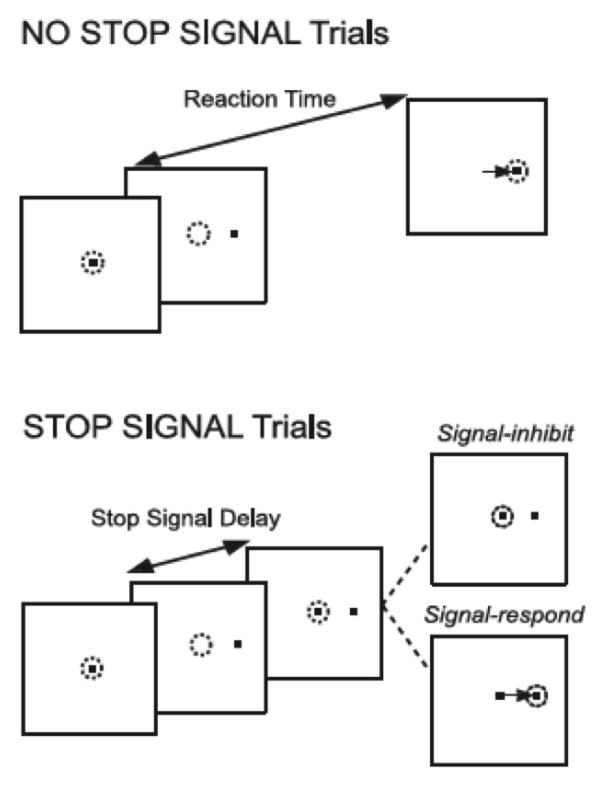

# Qhelp 2023 project 

The goal of this project is to generate and visualize cumulative probability distributions of reaction times in the general race model using copulas. With the help of a shiny-app, the user can try out different starting configurations by choosing custom copulae and marginals. 

### Stop signal paradigm: 
The stop signal paradigm is an experimental setup within which subjects are instructed to respond to a cue ("go" signal) as fast as possible by for example pressing a button (no stop signal trials). In a small subset of trials, shortly after the "go" signal, an additional "stop" signal is presented which requires participants to inhibit the initiated response. Within these stop-signal trials, participants might or might not manage to inhibit the go. 

The general race model describes the random processing time for the go and stop signals duding the stop-signal trials as a bivariate distribution function.  

$$ H(s, t) = P(T_{go} \le s, T_{stop} \le t) $$ 

for all $s,t \ge 0$  

The marginals of this distribution can be described with: 

$$ F_{go}(s) = P(T_{go} \le s, T_{stop} < \infty) $$
$$ F_{stop}(t) = P(T_{go} < \infty, T_{stop} \le t) $$

